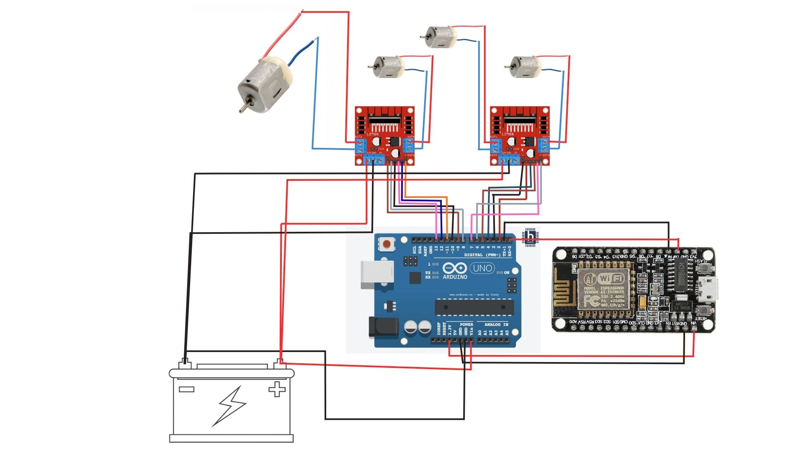

# ESP8266-CAR: WiFi Controlled All-Wheel Drive Robot Car  

## 🎯 Introduction
This project demonstrates a WiFi-controlled robotic car built using **ESP8266 (NodeMCU)** and **Arduino Uno**. It integrates wireless communication, motor control, and hardware troubleshooting to create a functional IoT-based vehicle.  

I built this as part of my **Electronics & Communication Engineering** journey at **Government Engineering College, Rajkot (GTU)** to strengthen my skills in IoT, serial communication, and embedded systems.  

## 🚀 Features
- WiFi-controlled via mobile app (ESP8266 WiFi Robot Car).  
- All-wheel drive with high torque (500 RPM DC motors).  
- Load carrying capacity: **up to 3–3.5 kg**.  
- Dual motor-driver (L298N) setup for better control.  
- ESP8266 ↔ Arduino serial communication for command handling.  

## 🛠️ System Overview
1. **Mobile App** → Sends commands (‘F’, ‘B’, ‘L’, ‘R’, ‘S’).  
2. **ESP8266** → Hosts local server, receives and filters data.  
3. **Arduino Uno** → Interprets commands and controls motor drivers.  
4. **L298N Motor Drivers** → Drive four DC motors for movement.  

## 📦 Components Used
- Arduino Uno  
- ESP8266 (NodeMCU)  
- 2 × L298N Motor Drivers  
- 4 × 500 RPM DC Motors  
- 12V Li-ion Battery  
- ESP8266 WiFi Robot Car (Android app)  

## ⚙️ Working
- Mobile app connects to ESP8266 WiFi.  
- Commands are received and forwarded via serial communication.  
- Arduino processes commands and drives the motors.  
- Car moves forward, backward, left, right, and stop.  

  
  

## 🔧 Challenges & Solutions
- **Issue:** No servo steering → car couldn’t turn smoothly.  
  - **Solution:** Used differential motor control (left motors backward, right motors forward).  

- **Issue:** Large chassis → difficult to take sharp turns.  
  - **Solution:** Adjusted motor placement closer to center for better turning radius.
 
    
    

## 📚 Learning Outcomes
- Hosting a local server on ESP8266.  
- Wireless communication between mobile & microcontroller.  
- Serial communication between ESP8266 and Arduino.  
- Motor control using L298N.  
- Hardware troubleshooting & optimization.  

## 🚀 Future Improvements
- Add servo-based steering for smoother turns.  
- Integrate sensors (IR/Ultrasonic) for obstacle avoidance.  
- Develop a custom mobile app with better UI.  

## 📂 Setup & Usage
1. Upload `UNOL298N.ino` to Arduino Uno.  
2. Upload `ESP8266.ino` to NodeMCU.  
3. Connect hardware as per circuit diagram.  
4. Install **ESP8266 WiFi Robot Car** app from Play Store.  
5. Connect mobile to `ESP8266 CAR` WiFi network.  
6. Control car via app.  

  

## 👨‍💻 Author
**Dev Yadav**  
- B.Tech, Electronics & Communication Engineering  
- Government Engineering College, Rajkot (GTU), Gujarat, India  
- LINKEDIN : [Deev Yadav](#) | EMAIL : [devyadav3672@gmail.com](#)  

