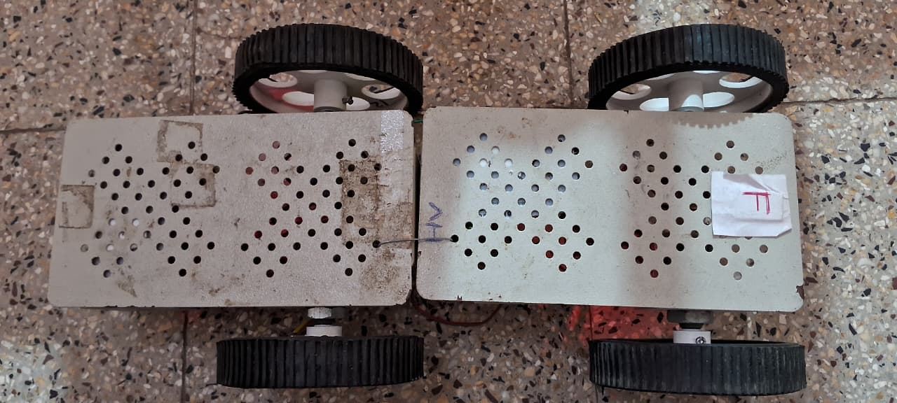
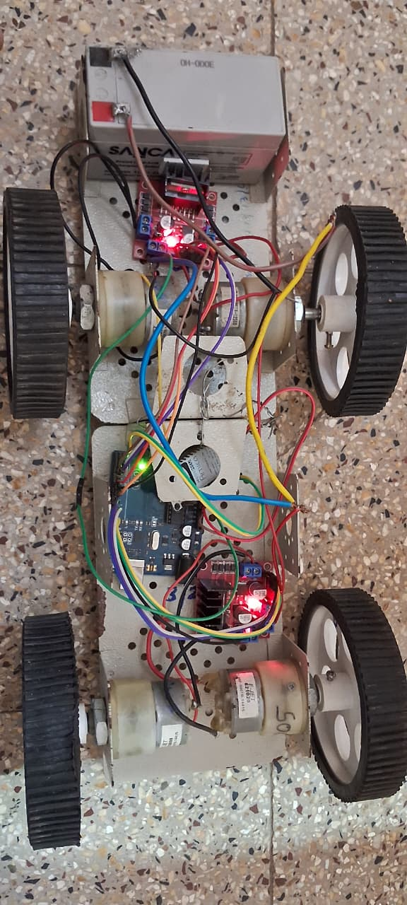

#  ESP8266-CAR: WiFi Controlled All-Wheel Drive Robot Car

  PURPOSE TO BUILD THIS PROJECT :
- I am pursuing electronics and communication engineering degree from Govt. engineering college(Rajkot,Gujrat) that belongs from Gujrat technological university and I have made this project to learn WiFi communicate and control actuators with ESP8266 by hosting a local server , i have host a local server using ESP8266 to send and recive wireless data from a mobile phone.
- secondly i have made learned how to control DC motors by L298N(motor driver).
- also i learn how to send and recive data between ESP826 and arduino UNO by Serial communication.
 UNIQUENESS OF THIS PROJECT :
- This car can also lift weights around 3–3.5 kg because I have used 500 rpm DC motors with a metal chassis, so it can transport a load as well.

PROJECT OVEREVIEW :
The ESP8266-CAR is an all-wheel drive robotic car controlled wirelessly via a mobile app. It demonstrates integration of Arduino Uno, ESP8266 WiFi module, and dual L298N motor drivers to create a fully controllable robotic vehicle. 

I am using "ESP8266 WiFi Robot Car" to send signal from mobile to ESP8266 , with help of code i have filtered raw data coming from mobile.

Here ESP8266 is used to recive wireless data from mobile and then i have trasferd this data to the arduino uno and their arduino uno is controlling the Motor driver on the basis of data given by ESP8266 , i have used Serial communication to treansfer data from ESP8266 to Arduino uno.

WORKING OF EVERY COMPONENTS :
1. Mobile App: Sends commands ('F', 'B', 'L', 'R', 'S') via WiFi.  
2. ESP8266: Receives raw data and filters it to a single character command.  
3. Arduino Uno: Reads the character via Serial communication, interprets the command, and controls the motor drivers accordingly.  
4. L298N Motor Drivers: Drive the four DC motors to move the car forward, backward, left, right, or stop. 

COMPONENTS :
- Microcontroller: Arduino Uno  
- Wireless Module: ESP8266 (NodeMCU)  
- Motor Drivers: 2 × L298N  
- Motors: 4 × DC motors   
- Battery: 12V Li-ion battery (power motors and Arduino)  
- Mobile App: ESP8266 WiFi Robot Car

- 

  ISSUESS DURING THIS PROJECT :
(1) i have not used any servo motors to turn the motor/wheel's direction it was a big issue becaues car was moving forward and backward but not taking turn.

(2) second issue is ,i have used two chassis for thi project due to higher diameter of wheels so the overall lngth of car get increased , when first time i have assembled everything and start the car the car was moving forward and backward smoothly but when turn left and right it was difficult ,car was not turnning properly.     

SOLUTION OF ISSUES :
(1) i turned car backwardly instide of turning it forwardly , for the "LEFT TURN" i run the left sided motors in backward direction and right sided motors in forward direction so here overall force get applied to get left turn and for the right turn i have used same method there i turn right sided motors in 

(2) but still due long length of car i was facing same difficulty car was forcing to turn but not taking full turn htere i placed the wheels(with motors) from back side to the middle of the car and then i am getting more control on car and car was turning properly and smoothly.

HOW TO BUILD THIS PROJECT OR HOW TO USE COMPONENTS INDIVIDUALLY:
we can use this whole project in two way ,  we can use this codes and guidance to build the same car and on the otherside we can use this codes to use different components individually 

TO BUILD THIS SAME PROJECT: 
(1) upload the "UNOL298N" code to the arduino UNO board 
(2) upload the "ESP8266" code to the ESP8266 board 
(3) connect the jumper wires as shown in image with ESP8266 , arduino uno , L298N , battery.
(4) Install the "ESP8266 WiFi Robot Car" anddroid app from the playstore on your mobile phone
(5) connect your mobile's wifi to the "ESP8266 CAR" named network.
(6) now your are ready to control your car from your mobile phone.

HOW TO USE THIS CODES FOR INDIVIDUAL COMPONENTS :
This project can mainly divided in three parts , firt part is to communicate with ESP8266 board from our mobile phone and  second side we part is to control motors by arduino uno or last part is to communicate between ESP8266 and Arduino UNO via serial communcation.

HOW TO USE THIS Arduino CODE INDIVIDUALLY FOR DIFEERENT USES :
if you want to use a bluetooth module or by another way , you can use this code to control 4 motors with two L298N by sending same signal as mentioned in code and connect the circuit as given in image.

HOW TO USE ESP8266 CODE TO COMMUNICATE BETWEEN MOBILE AND ESP82666:
Upload the "ESP8266L298N" named code on microcontroller board and connect your mobile phone with microcontroller's wifi and you can interchange data with ESP8266.
